<div align="center">

# Hyprdots

*A meticulously crafted Hyprland rice where every pixel adapts to your mood*

Seamless theme switching across your entire desktop. One command transforms window borders, status bars, terminals, notifications, and even your browser.

[Features](#features) • [Themes](#themes) • [Installation](#installation) • [Usage](#usage)

---

</div>

## Themes

<div align="center">

### Rose Pine
*Soft, muted tones with warm accents*

<table>
<tr>
<td width="50%">

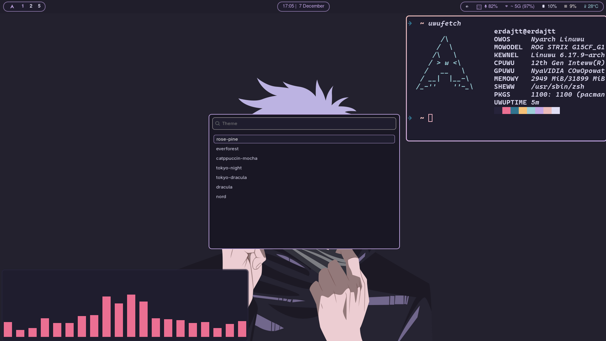

</td>
<td width="50%">

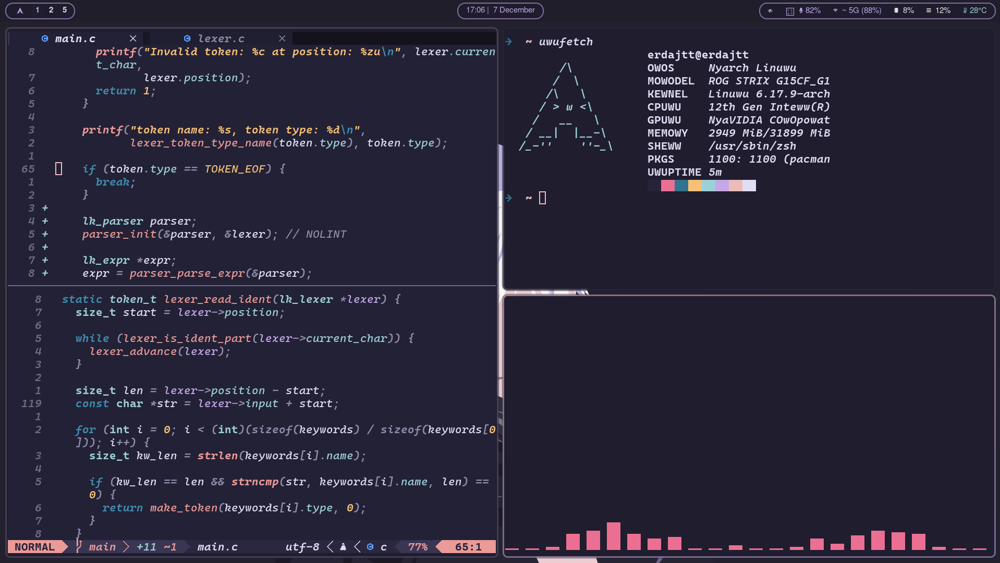

</td>
</tr>
</table>

A gentle, low-contrast palette inspired by the Rosé Pine color scheme. Features a moon-like terminal background with subtle pink cursor highlights and purple-teal waybar accents.

---

### Nord
*Arctic, frost-inspired elegance*

<table>
<tr>
<td width="50%">

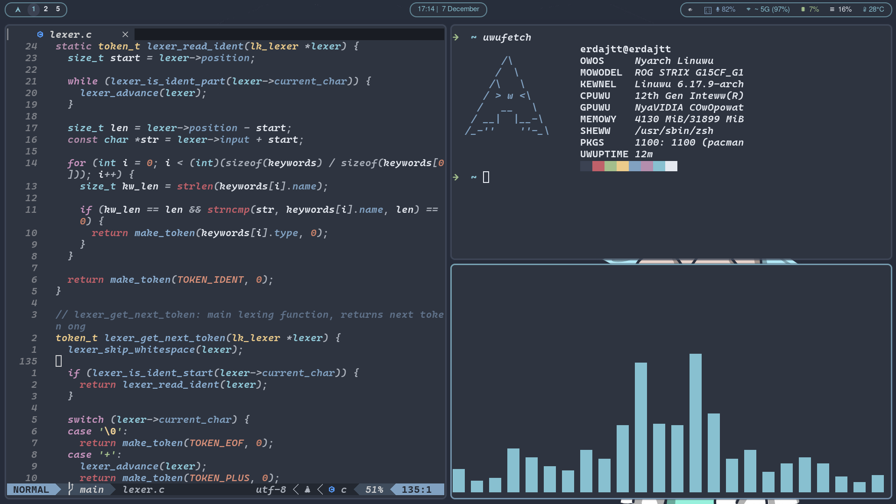

</td>
<td width="50%">

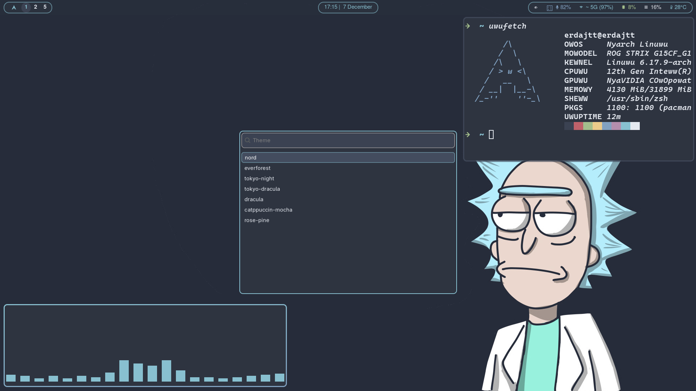

</td>
</tr>
</table>

Clean, crisp colors drawn from the frozen north. Cooler tones throughout with ice-blue highlights and excellent readability in any lighting condition.

---

### Tokyo Dracula
*Cyberpunk meets vampiric aesthetics*

<table>
<tr>
<td width="50%">

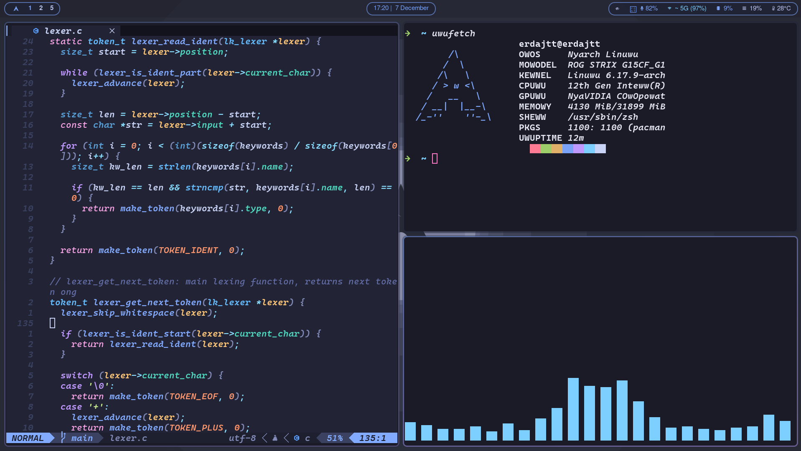

</td>
<td width="50%">

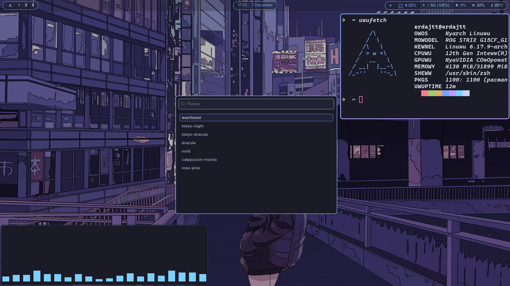

</td>
</tr>
</table>

A fusion of Tokyo Night's neon vibes and Dracula's purple-pink palette. Perfect for late-night coding sessions with rich purples and electric accents.

---

### Everforest
*Natural, forest-inspired calm*

<table>
<tr>
<td width="50%">

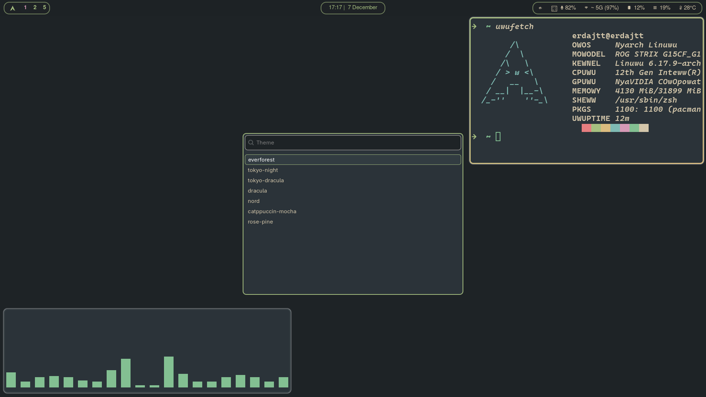

</td>
<td width="50%">

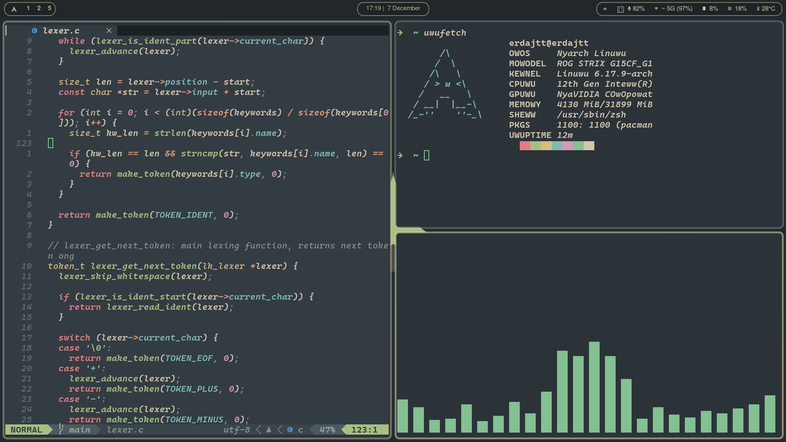

</td>
</tr>
</table>

The default theme. Warm greens and earthy tones that are easy on the eyes. Designed for comfortable long-term use with excellent contrast.

---

### Catppuccin Mocha
*Smooth, pastel sophistication*

<table>
<tr>
<td width="50%">


</td>
<td width="50%">

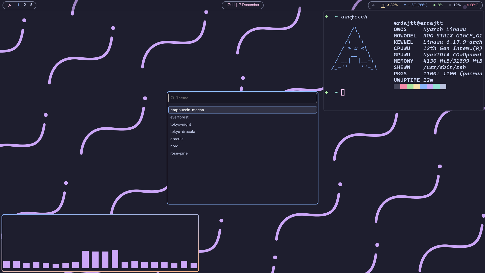

</td>
</tr>
</table>

Soothing pastel colors with a dark mocha background. Trendy yet timeless with carefully balanced accent colors.

---

### Tokyo Night
*Neon-lit streets after dark*

<table>
<tr>
<td width="50%">

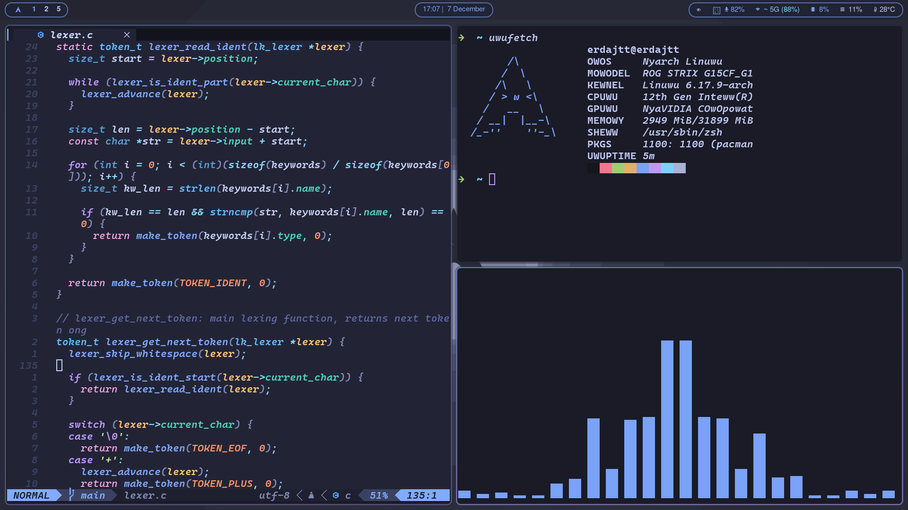

</td>
<td width="50%">

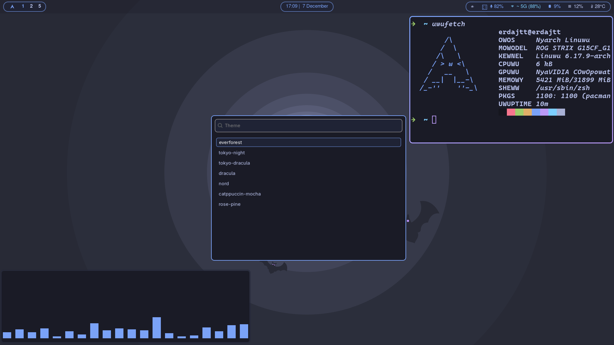

</td>
</tr>
</table>

Deep blues and purples with vibrant highlights. Inspired by Tokyo's night skyline with modern, sleek aesthetics.

---

### Dracula
*Classic vampire elegance*

<table>
<tr>
<td width="50%">

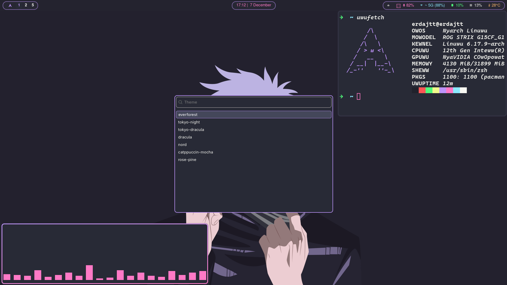

</td>
<td width="50%">


</td>
</tr>
</table>

The beloved dark theme with purple backgrounds and pink-cyan accents. High contrast and instantly recognizable.

</div>

---

## Features

### 🎨 Unified Theme System
One command switches everything. No manual edits, no restart loops, no inconsistencies.

**What changes:**
- Hyprland window borders and decorations
- Waybar panels and widgets
- Alacritty terminal colors and cursor
- Wofi launcher and menus
- Dunst notifications
- Firefox browser theme
- Neovim default colorscheme

**What persists:**
- Per-theme wallpaper memory
- Theme state across reboots
- All Neovim themes remain available regardless of system theme

### 🖼️ Wallpaper Management
Each theme remembers your last wallpaper choice. Switch back to Rose Pine and your curated wallpaper is already set.

```
~/Wallpapers/           Shared across all themes
~/Wallpapers/rose-pine/ Rose Pine exclusives
~/Wallpapers/nord/      Nord exclusives
~/Wallpapers/tokyonight/Tokyo Night exclusives
```

The wallpaper picker shows theme-specific wallpapers first, then falls back to the shared collection.

### 🔔 Notification Theming
Dunst notifications adapt to your active theme with matching colors and follow your mouse across monitors.

### 🚀 Launcher & Pickers
Wofi menus are fully themed with solid backgrounds, readable text, and consistent spacing. No transparency issues, no white flashes.

---

## Installation

### Dependencies
```bash
hyprland waybar alacritty wofi dunst firefox neovim imagemagick
```

### Setup
```bash
cd ~
git clone <your-repo-url> P9/dump/hyprdots

cd ~/.config
ln -sf ~/P9/dump/hyprdots/hypr hypr
ln -sf ~/P9/dump/hyprdots/waybar waybar
ln -sf ~/P9/dump/hyprdots/alacritty alacritty
ln -sf ~/P9/dump/hyprdots/wofi wofi
ln -sf ~/P9/dump/hyprdots/dunst dunst
ln -sf ~/P9/dump/hyprdots/.zshrc ~/.zshrc

mkdir -p ~/Wallpapers/{rose-pine,nord,tokyonight,everforest,catppuccin,dracula,tokyo-dracula}
rsync -av ~/P9/dump/hyprdots/Wallpapers/ ~/Wallpapers/
```

Set default theme:
```bash
~/.config/hypr/scripts/theme-toggle.sh --theme everforest --no-menu
```

---

## Usage

### Theme Switching

**Interactive picker:**
```bash
~/.config/hypr/scripts/theme-toggle.sh
```

**Direct switch:**
```bash
~/.config/hypr/scripts/theme-toggle.sh --theme rose-pine --no-menu
~/.config/hypr/scripts/theme-toggle.sh --theme nord --no-menu
~/.config/hypr/scripts/theme-toggle.sh --theme tokyo-dracula --no-menu
```

**Available themes:**
`everforest` • `rose-pine` • `nord` • `tokyo-night` • `tokyo-dracula` • `dracula` • `catppuccin-mocha`

### Wallpaper Picker
```bash
~/.config/hypr/scripts/wallpicker.sh
```
Theme wallpapers appear first, then shared wallpapers. Your choice is remembered per theme.

### Neovim Integration
Your system theme sets the Neovim default via `~/.config/nvim/.theme`, but all installed themes remain accessible.

**Manual theme switch:**
```vim
:colorscheme catppuccin-mocha
:colorscheme rose-pine
:colorscheme tokyonight
```

**Available:**
`nightfox` • `github` • `eldritch` • `rose-pine` • `zenbones` • `tokyo` • `everforest` • `catppuccin` • `dracula` • `nord` • `sonokai`

---

## Customization

### Adding a New Theme

1. `~/.config/hypr/themes/<theme-name>.conf` - Window border colors
2. `~/.config/waybar/themes/<theme-name>.css` - Status bar styling
3. `~/.config/alacritty/themes/<theme-name>.toml` - Terminal palette
4. `~/.config/wofi/themes/<theme-name>.css` - Launcher styling
5. `~/.config/dunst/themes/<theme-name>.conf` - Notification colors
6. `~/Wallpapers/<theme-name>/` - Theme wallpapers

Add your theme to the picker in `theme-toggle.sh`.

### Keybinds
Edit `~/.config/hypr/keybinds.conf`:
```
bind = SUPER, T, exec, ~/.config/hypr/scripts/theme-toggle.sh
bind = SUPER, W, exec, ~/.config/hypr/scripts/wallpicker.sh
```

### Waybar Layout
Customize modules in `~/.config/waybar/config.jsonc` and per-theme styling in `~/.config/waybar/themes/`.

---

## File Structure
```
hyprdots/
├── alacritty/       Terminal emulator config
├── boot/            Bootloader theming scripts
├── dunst/           Notification daemon config
├── hypr/            Hyprland compositor config
│   ├── scripts/     Theme toggle, wallpaper picker
│   └── themes/      Per-theme border colors
├── waybar/          Status bar config
│   └── themes/      Per-theme CSS
├── wofi/            Launcher config
│   └── themes/      Per-theme CSS
├── Wallpapers/      Wallpaper collection
│   ├── rose-pine/
│   ├── nord/
│   └── ...
└── .zshrc           Shell configuration
```

---

<div align="center">

## Credits

Built for a seamless, performant, and beautiful Hyprland experience.

**Themes** • [Everforest](https://github.com/sainnhe/everforest) • [Rose Pine](https://rosepinetheme.com/) • [Nord](https://www.nordtheme.com/) • [Tokyo Night](https://github.com/enkia/tokyo-night-vscode-theme) • [Dracula](https://draculatheme.com/) • [Catppuccin](https://github.com/catppuccin/catppuccin)

**Tools** • [Hyprland](https://hyprland.org/) • [Waybar](https://github.com/Alexays/Waybar) • [Wofi](https://hg.sr.ht/~scoopta/wofi) • [Dunst](https://dunst-project.org/)

</div>
